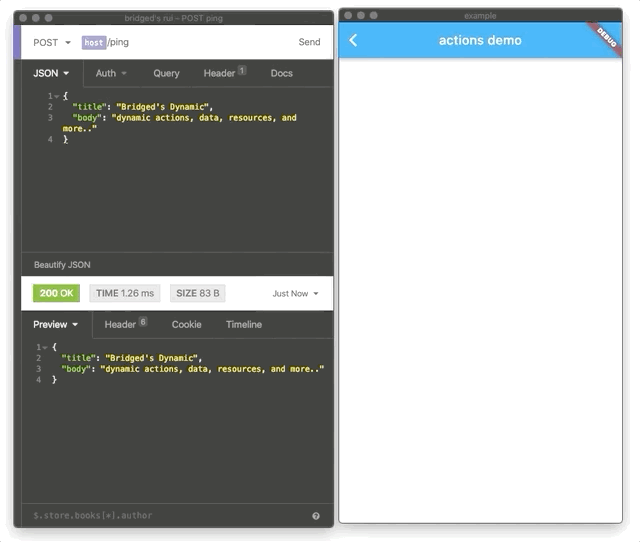

> Dynamix. a remotely configured user interface with super flexibility. Make web / app / webview / server to work as one.

server - dynamically change client specs from server

client - dynamically load content from server & with dynamic layout / component / action specs

| Platform                                                                                                              | Package                                                            |
| --------------------------------------------------------------------------------------------------------------------- | ------------------------------------------------------------------ |
| NodeJS (for server)                                                                                                   | [@bridged.xyz/remote-ui-core](./core) [![npm]](npm-remote-ui-core) |
| <br />[@bridged.xyz/remote-ui-server](./server) [![npm]](https://www.npmjs.com/package/@bridged.xyz/remote-ui-server) |
| NodeJS (for web)                                                                                                      | (comming soon)<br />(@bridged.xyz/remote-ui)                       |
| Flutter                                                                                                               | [dynamic](./flutter) [![pub]](pub-flutter_remote_ui)<br />         |

**sub packages**

- [x_icon](./flutter/packages/x_icon) [![pub]](https://pub.dev/packages/flutter_remote_icon)

- [x_icon_generator](./flutter/packages/x_icon_generator) [![pub]](https://pub.dev/packages/x_icon_generator)

- [x_color](./flutter/packages/x_color) [![pub]](https://pub.dev/packages/x_color)

* [x_action](./flutter/packages/x_action) [![pub]](https://pub.dev/packages/x_action)

## dyanmic actions



## Installation

Server side

```shell
# install with yarn
yarn add @bridged.xyz/remote-ui-core

# install with npm
npm install @bridged.xyz/remote-ui-core
```

## How to use

server side (express/ts)

```ts
import * as rui from "@bridged.xyz/remote-ui-core";

router.get("ui", (req, res) => {
  const ui = new rui.Layout({
    icon: rui.icons.material.note.uri,
    title: new rui.Text("hello world!"),
  });
  res.json(ui).send();
});
```

app side (flutter)

```dart
import "package:flutter_remote_ui/flutter_remote_ui.dart"

Widget buildRui(BuildContext context){
 final ruiData = fetchRuiDataFromServer();
 return RemoteUI.of(context).build(ruiiData);
}
```

Concepts & onthology will be documented under notion document, which will be added soon.

## Platform support

|                | usage                                                                                      | language | runs on                                                    | example                                                                                                                                                                                          | Ready? |
| -------------- | ------------------------------------------------------------------------------------------ | -------- | ---------------------------------------------------------- | ------------------------------------------------------------------------------------------------------------------------------------------------------------------------------------------------ | ------ |
| core           | rui core library ([@bridged.xyz/remote-ui-core](./core))                                   | TS/JS    | NodeJS                                                     | [@bridged.xyz/remote-ui-core](https://github.com/softmarshmallow/remote-ui/tree/master/core)                                                                                                     | ✅     |
| flutter        | [flutter_remote_ui](./flutter)                                                             | dart     | iOS<br />Android<br />OSX<br />Windows<br />Linux<br />Web | [flutter-remote-ui](https://github.com/softmarshmallow/remote-ui/tree/master/flutter)<br />[flutter remote ui example](https://github.com/softmarshmallow/remote-ui/tree/master/flutter/example) | ✅     |
| express        | remote-ui-core wrapper for ExpressJS ([@bridged.xyz/remote-ui-server](./server)) (in 2020) | TS/JS    | NodeJS (server)                                            | [express](https://github.com/softmarshmallow/remote-ui/tree/master/server/examples/express), [plain](https://github.com/softmarshmallow/remote-ui/tree/master/server/examples/plain)             | 👩‍💻     |
| iOS native     | note supported (2021 Q2)                                                                   | swift    | iOS OSX                                                    |                                                                                                                                                                                                  | 👩‍💻     |
| android native | note supported (2021 Q2)                                                                   | kotlin   | Android                                                    |                                                                                                                                                                                                  | 👩‍💻     |
| vue            | vueJS wrapper for remote-ui                                                                |          | Web                                                        |                                                                                                                                                                                                  | 👩‍💻     |

## Concepts

| concept | description                                                                                                                                   | example | demo |
| ------- | --------------------------------------------------------------------------------------------------------------------------------------------- | ------- | ---- |
| action  | provide client action data to be executed on specific events                                                                                  |         |      |
| layout  | register & call layouts with built data dynamically                                                                                           |         |      |
| icon    | register & use font based icons or svg icons dynamically                                                                                      |         |      |
| image   | use registered local assets or remote assets dynamically                                                                                      |         |      |
| route   | specify route spec to provide routing, building menus, shortcuts, etc..                                                                       |         |      |
| modal   | show modals with custom transition with desired content                                                                                       |         |      |
| client  | the client is the app instance, customize with your database user                                                                             |         |      |
| session | the session of single flow. show modal, get event of "ok" button clicked, trigger the action in single session so it can be tracked & managed |         |      |

### Remote Icons

```typescript
import * as rui from "@bridged.xyz/remote-ui-core";

console.log(rui.icons.material.note);

/// logs
/// RemoteIconData {
///  uri: 'material://Icons.note',
///  type: 'MATERIAL_NATIVE',
///  asset: undefined }

/// can be used directly on flutter
```

## Remote Route Specs

```typescript
import { routes } from "@bridged.xyz/remote-ui-core";

const MOCK_DATABASE = {
  users: [
    {
      id: "1",
      name: "softmarshmallow",
    },
    {
      id: "2",
      name: "GY",
    },
    {
      id: "3",
      name: "gin",
    },
  ],
};

function fetchUserFromMockDatabase(id: string): { id; name } {
  return MOCK_DATABASE.users.find((e) => e.id == id);
}

routes.register(
  new routes.spec(
    new routes.spec<{ id }, { id; name }>({
      key: "/users/:id",
      pattern: "/users/:id",
      dataFetcher: async (p) => {
        return fetchUserFromMockDatabase(p.id);
      },
      title: {
        default: "user detail",
        template: "user {{ data.name }}",
      },
    })
  )
);

const route = "/users/1";
const spec = routes.match(route);
routes.build(spec).then((d) => {
  console.log(d);
});

/// logs
/// { title: 'user softmarshmallow',
///  description: undefined,
///  icon: undefined,
///  route: '/users/1' }
```

## Contribution

[contribution guideline](CONTRIBUTING.md)

## Contributor's documentation

we are using [figma file](https://www.figma.com/file/DpbDmtkGzz1g3aXPt5MmgS/remote-ui?node-id=135%3A32) for the contributor's documenting and suggesting roadmap.

## TODO

- remote ui dashboard -> customize & configure your app through web interface remotely, realtime.

## related projects

- [bridged.xyz](https://github.com/softmarshmallow/bridged.xyz)
- [bridged's inapp-bridge](https://github.com/softmarshmallow/inapp-bridge)
- [bridged's schema-studio](https://github.com/softmarshmallow/schema-studio)

### Sponsors

### References

[dynamic_widget](https://github.com/dengyin2000/dynamic_widget)

### Use dynamic with figma plugin / bridged console

**comming soon features**

- sync assets directly (dont download, put it in asset. bridged provides bucket and usable resource uri. s3 GCP supported)
- live update data

### Blogs

[starting remote ui project](https://medium.com/launchers/starting-remote-ui-project-4b1d0841afc2)

[npm]: https://img.shields.io/badge/npm-latest-brightgreen
[pub]: https://img.shields.io/badge/pub-latest-brightgreen
[npm-remote-ui-core]: https://www.npmjs.com/package/@bridged.xyz/remote-ui-core
[pub-flutter_remote_ui]: https://pub.dev/packages/flutter_remote_ui
