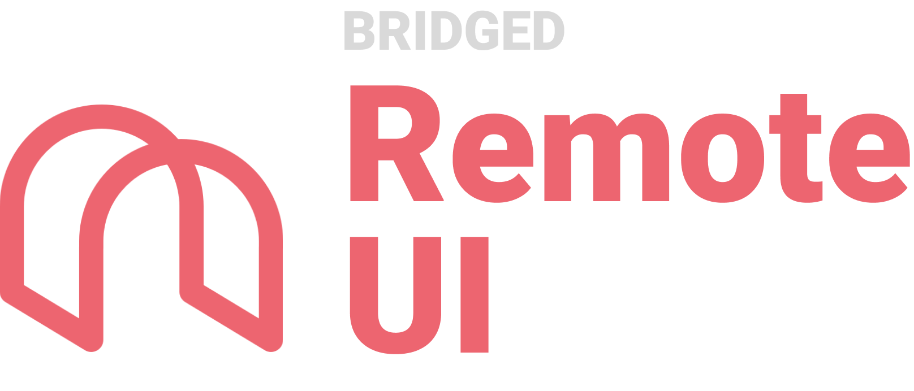

# remote-ui


server - dynamically change client specs from server

client - dynamically load content from server & with dynamic layout / component / action specs


## How to use
server side (express/ts)
```ts
import * as rui from "@bridged.io/remote-ui-core"

router.get("ui", (req, res)=>{

 const ui = new rui.Layout(
  {
   icon: rui.Icon.MaterialIcns.note.uri,
   title: new rui.Text("hello world!")
  }
 );
 res.json(ui).send()
})
```


app side (flutter)
```dart
import "package:flutter_remote_ui/flutter_remote_ui.dart"

Widget buildRui(BuildContext context){
 final ruiData = fetchRuiDataFromServer();
 return RemoteUI.of(context).build(ruiiData);
}
```


Concepts & onthology will be documented under notion document, which will be added soon.


## Platform support

**Web**

* server
  * language: ts/js [@bridged.io/remote-ui-core](https://github.com/softmarshmallow/remote-ui/tree/master/core)
  * examples: [express](https://github.com/softmarshmallow/remote-ui/tree/master/server/examples/express), [plain](https://github.com/softmarshmallow/remote-ui/tree/master/server/examples/plain)
* client
  * Language: ts/js
  * Examples: vue


**App**

* [flutter-remote-ui](https://github.com/softmarshmallow/remote-ui/tree/master/flutter-remote-ui)
  * examples: [flutter remote ui example](https://github.com/softmarshmallow/remote-ui/tree/master/flutter-remote-ui/example)
* android
* ios


## Contribution
contact woojoo@softmarshmallow.com for contribution or package usage


## TODO
* remote ui dashboard -> customize & configure your app through web interface remotely, realtime.


## related projects
- bridged.io
- [bridged's inapp-bridge](https://github.com/softmarshmallow/inapp-bridge)
- [bridged's schema-studio](https://github.com/softmarshmallow/schema-studio)


### Sponsors

### Blogs
[starting remote ui project](https://medium.com/launchers/starting-remote-ui-project-4b1d0841afc2)

